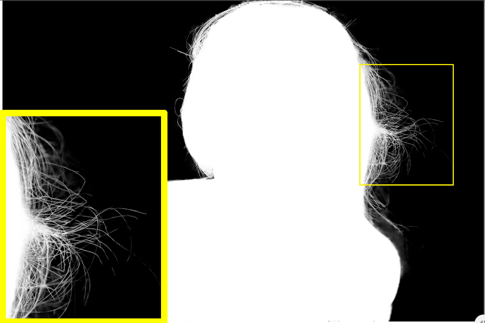

# IndexNet Matting

<p align="center">
  
  
</p>

This repository includes the official implementation of IndexNet Matting for deep image matting, presented in our paper:

**[Indices Matter: Learning to Index for Deep Image Matting](https://arxiv.org/pdf/1908.00672.pdf)**

Proc. IEEE/CVF International Conference on Computer Vision (ICCV), 2019

[Hao Lu](https://sites.google.com/site/poppinace/)<sup>1</sup>, Yutong Dai<sup>1</sup>, [Chunhua Shen](http://cs.adelaide.edu.au/~chhshen/)<sup>1</sup>, Songcen Xu<sup>2</sup>

<sup>1</sup>The University of Adelaide, Australia

<sup>2</sup>Noah's Ark Lab, Huawei Technologies

## Updates
- 4 April 2020: Training code is released!
- 16 Aug 2019: The supplementary material is finalized and released!
- 5 Aug 2019: Inference code of IndexNet Matting is released!


## Highlights
- **Simple and effective:** IndexNet Matting only deals with the upsampling stage but exhibits at least 16.1% relative improvements, compared to the Deep Matting baseline;
- **Memory-efficient:** IndexNet Matting builds upon MobileNetV2. It can process an image with a resolution up to 1980x1080 on a single GTX 1070;
- **Easy to use:** This framework also includes our re-implementation of Deep Matting and the pretrained model presented in the Adobe's CVPR17 paper.

## Installation
Our code has been tested on Python 3.6.8/3.7.2 and PyTorch 0.4.1/1.1.0. Please follow the official instructions to configure your environment. See other required packages in `requirements.txt`.

## A Quick Demo
We have included our pretrained model in `./pretrained` and several images and trimaps from the Adobe Image Dataset in `./examples`. Run the following command for a quick demonstration of IndexNet Matting. The inferred alpha mattes are in the folder `./examples/mattes`.

    python scripts/demo.py
    
## Prepare Your Data
1. Please contact Brian Price (bprice@adobe.com) requesting for the Adobe Image Matting dataset;
2. Composite the dataset using provided foreground images, alpha mattes, and background images from the COCO and Pascal VOC datasets. I slightly modified the provided `compositon_code.py` to improve the efficiency, included in the `scripts` folder. Note that, since the image resolution is quite high, the dataset will be over 100 GB after composition.
3. The final path structure used in my code looks like this:

````
$PATH_TO_DATASET/Combined_Dataset
├──── Training_set
│    ├──── alpha (431 images)
│    ├──── fg (431 images)
│    └──── merged (43100 images)
├──── Test_set
│    ├──── alpha (50 images)
│    ├──── fg (50 images)
│    ├──── merged (1000 images)
│    └──── trimaps (1000 images)
````

## Inference
Run the following command to do inference of IndexNet Matting/Deep Matting on the Adobe Image Matting dataset:

    python scripts/demo_indexnet_matting.py
    
    python scripts/demo_deep_matting.py
    
Please note that:
- `DATA_DIR` should be modified to your dataset directory;
- Images used in Deep Matting has been downsampled by 1/2 to enable the GPU inference. To reproduce the full-resolution results, the inference can be executed on CPU, which takes about 2 days.

Here is the results of IndexNet Matting and our reproduced results of Deep Matting on the Adobe Image Dataset:

| Methods | Remark | #Param. | GFLOPs | SAD | MSE | Grad | Conn | Model |
| :--: | :--: | :--: | :--: | :--: | :--: | :--: | :--: | :--: |
| Deep Matting | Paper | -- | -- | 54.6 | 0.017 | 36.7 | 55.3 | -- |
| Deep Matting | Re-implementation | 130.55M | 32.34 | 55.8 | 0.018 | 34.6 | 56.8 | [Google Drive (522MB)](https://drive.google.com/open?id=1Uws86AGkFqV2S7XkNuR8dz5SOttxh7AY) |
| IndexNet Matting | Ours | 8.15M | 6.30 | 45.8 | 0.013 | 25.9 | 43.7 | Included |

* The original paper reported that there were 491 images, but the released dataset only includes 431 images. Among missing images, 38 of them were said double counted, and the other 24 of them were not released. As a result, we at least use 4.87% fewer training data than the original paper. Thus, the small differerce in performance should be normal.
* The evaluation code (Matlab code implemented by the Deep Image Matting's author) placed in the ``./evaluation_code`` folder is used to report the final performance for a fair comparion. We have also implemented a python version. The numerial difference is subtle.

## Training
Run the following command to train IndexNet Matting:

    sh train.sh
    
- `--data-dir` should be modified to your dataset directory.
- I was able to train the model on a single GTX 1080ti (12 GB). The training takes about 5 days. The current bottleneck appears to be the dataloader.

## Citation
If you find this work or code useful for your research, please cite:
```
@inproceedings{hao2019indexnet,
  title={Indices Matter: Learning to Index for Deep Image Matting},
  author={Lu, Hao and Dai, Yutong and Shen, Chunhua and Xu, Songcen},
  booktitle={Proc. IEEE/CVF International Conference on Computer Vision (ICCV)},
  year={2019}
}
```
## Disclaimer
As covered by the ADOBE IMAGE DATASET LICENSE AGREEMENT, the trained models included in this repository can only be used and distributed for non-commercial purposes. Anyone who violates this rule will be at his/her own risk.
